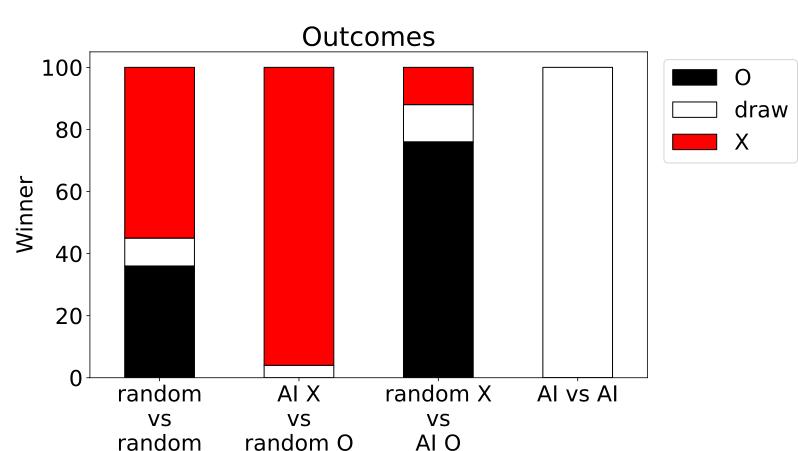

# Tic-Tac-Toe

Web interface to play Tic-Tac-Toe, it includes the possibilities to decide who starts the game and to change AI algorithms.

## AI players

### minimax

The classic minimax algorithm is for zero-sum games 

### classic Monte Carlo Tree Search: not implemented yet

### AlphaZero-like Neural Network

The details on the implementation can be found in the subfolder tf_models/ and the three jupyter notebook: 
* library_tests.ipynb: examples and tests of the module contained in the subfolder tf_models/libs/.
* TicTacToe-AlphaZero.ipynb: includes the training of the Neural Network.
* Results.ipynb: compares the results of the AlphaZero-like NN with random players and against itself (see also below).

