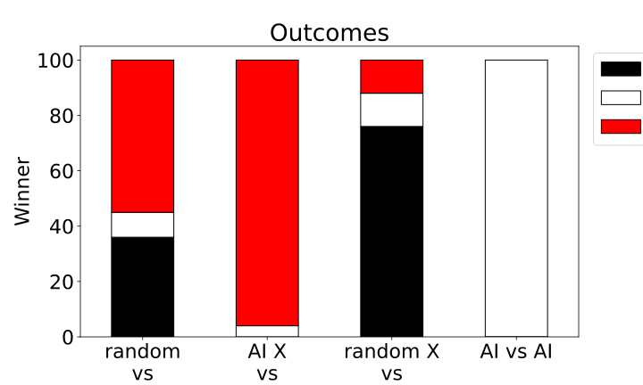

# Tic-Tac-Toe

Web interface to play Tic-Tac-Toe.

It implements a minimax algorithm and an AlphaZero-like Neural Networks as AI players.

## AI players

### minimax

### classic Monte Carlo Tree Search: not implemented yet

### AlphaZero-like Neural Network

The details on the implementation can be found in the subfolder tf_models/ and the three jupyter notebook: 
*[library_tests.ipynb]: includes examples and tests of the module contained in the subfolder tf_models/libs/.

