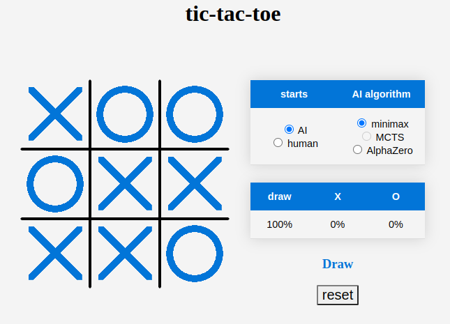

# Tic-Tac-Toe

Web interface to play Tic-Tac-Toe, it includes the possibilities to decide who starts the game and to change AI algorithms.

## AI players

### minimax

The classic minimax algorithm is for zero-sum games and since the relatively small size of the tree games, it's fast and accurate. 

### classic Monte Carlo Tree Search: not implemented yet

### AlphaZero-like Neural Network

**bug in the run of the model in tensorflow.js does not allow to play it**
This implementation was a first test of the AlphaZero network structure and training, to be able to extend it to more complicated games.
The details on the implementation can be found in the subfolder tf_models/ and the three jupyter notebook: 
* library_tests.ipynb: examples and tests of the module contained in the subfolder tf_models/libs/.
* TicTacToe-AlphaZero.ipynb: includes the training of the Neural Network.
* Results.ipynb: compares the results of the AlphaZero-like NN with random players and against itself (see also below).

The current results from the neural network trained on only 1000 games are almost perfect, see figure below. The training itself takes ~1-2 minutes, and the most computationally expensive part is to generate the training dataset, because of the MCTS algorithm.

The AI wins most of the games against a random player playing both X and O, and get a draw in a match against itself.